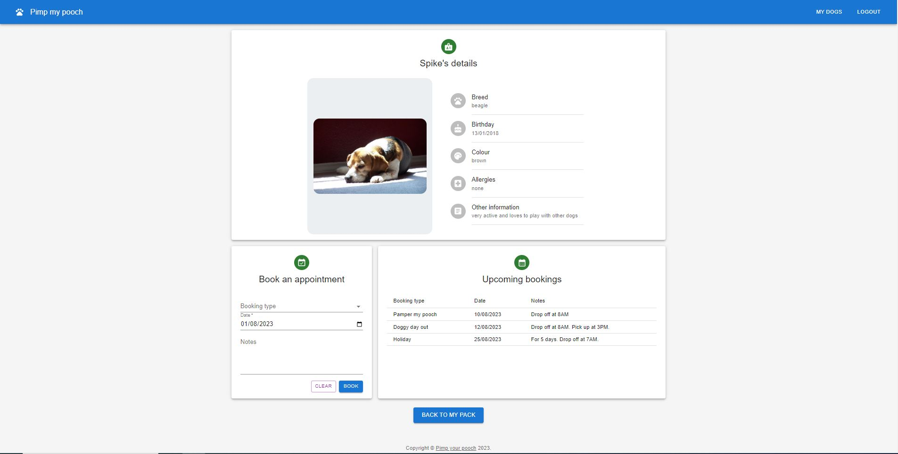

# pimp-your-pooch
This application is an online booking system for a dog grooming service.

## Description

This program is for an online booking system for a dog grooming, dog boarding and dog day care business.

## Table of Contents
- [Installation](#installation)
- [Usage](#usage)
- [Screenshot](#screenshot)
- [Video recording](#video-recording)
- [Credits](#credits)
- [License](#license)
- [Badges](#badges)
- [Features](#features)
- [Contributing](#contributing)
- [Tests](#tests)
- [Email address](#email-address)
- [Github username](#github-username)

## Installation
Run npm install to install the dependencies.
Run npm run seed to install the seed data.
Run the command **npm start** on the terminal to start the application.

## Usage
The program is deployed to heroku.
URL: https://pimp-your-pooch-2826a7e23bfe.herokuapp.com/

seed data:
1. username: justin, password: Password1234
2. username: miley, password: Password1234

## Screenshot

Below are some screenshots of the application.

1. Home page

2. Sign up page

3. Login page

4. Pets page

5. Pet info page

## Video recording

There is no video recording for this assignment.

## Credits
Massive thank you to Jack and Sid for being so helpful and for being an awesome teachers!

## License
n/a

## Badges

## Features
This program is a full MERN stack deployed on Heroku.
It also use the dog CEO api to provide list of breeds and a random photo of a dog according to the breed.
It allows a user to add a pet, delete a pet and book the available service offered by the business.

## Contributing
n/a

## Tests
n/a

## Email address
a.t@gmail.com

## Github username
allentpogi
